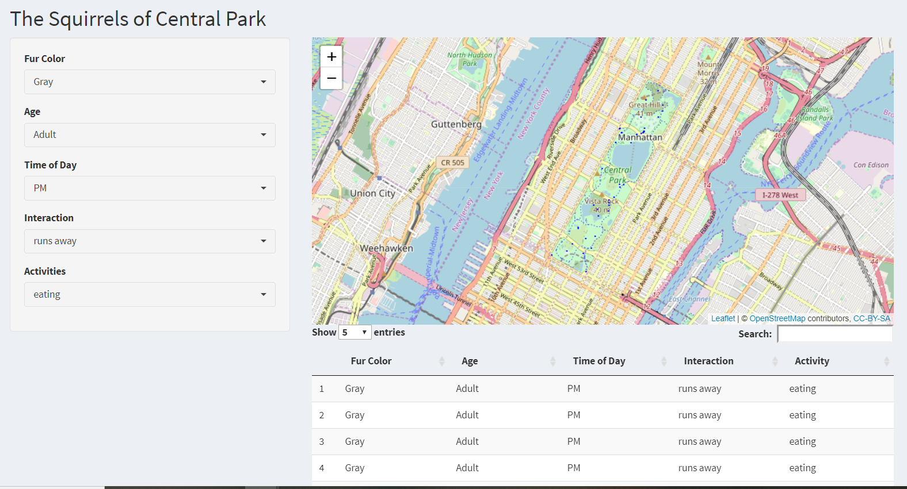
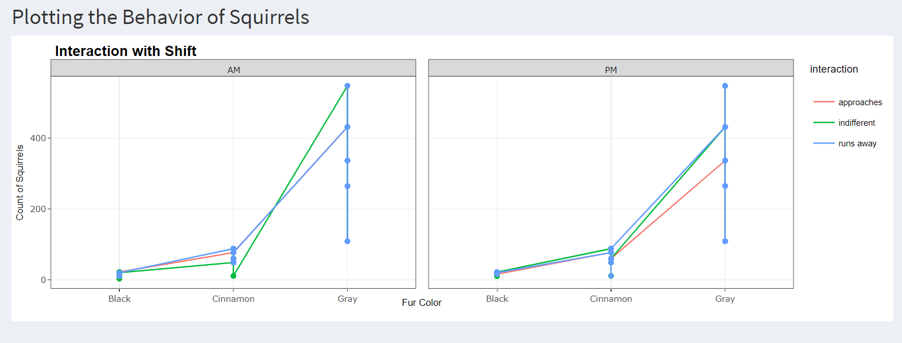
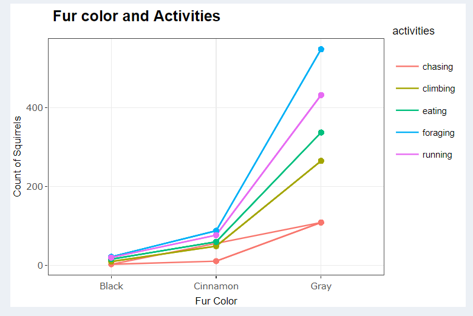
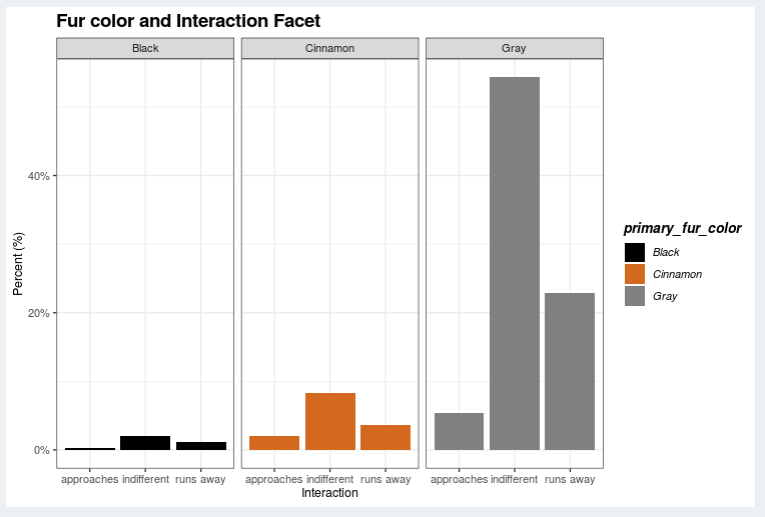

# New York City Squirrel Aggression
Analyzing the New York city squirrel aggression problem.
Project by: Mrinmayee Kulkarni, Andrew Grant, Kayla Harasymchuk, Katie Brizendine

https://andrew-grant.shinyapps.io/project/
Presentation: http://rpubs.com/agrant26/558175
Blogdown: https://determined-curie-89adf7.netlify.com/

In March of 2019, New York City brought forward a potential ban on feeding pigeons and squirrels. Bans on feeding other wild animals are already in place, but pigeons and squirrels were exceptions. If the bill becomes a law, individuals will be fined both for squirrel feeders and hand feeding the animals. The reason for the new ban is due to the increased aggression of squirrels, particularly the Eastern Gray Squirrels, resulting in an increased number of bites and scratches in recent years.  This aggression is due to a decreased fear of humans after being hand-fed.
Hand-feeding squirrels comes with a host of other problems for the squirrels. As squirrels are readily supplied human food, they do not receive the same nutritional benefit as squirrels in the wild. In addition, this decreased reliance on foraging means squirrels lose much of their natural survival instinct.
With the current data, we are targeting the behavior of gray squirrels as they make up the majority of squirrels in New York City. In addition, gray squirrels cause other problems as well, becoming a leading cause of power outages across the US due to chewing on power lines. We are looking to see whether the behaviors of the grey squirrels are more aggressive than other squirrels found in the park and develop a baseline measure for the squirrel’s fear to humans to determine if the ban has any effect over time. The aim of this app is to be used by New York legislature and civilians to learn more about the New York City squirrel population to decide if this ban should be implemented.

Leaflet: The map of the squirrel locations, their activities and interactions during a given time of the day

Shift: Understanding the behavioural pattern with plotly

Activities: Plotting with the squirrel activities 

Interaction: Interaction level of the squirrels by the percentage of their count and faceted by fur color

